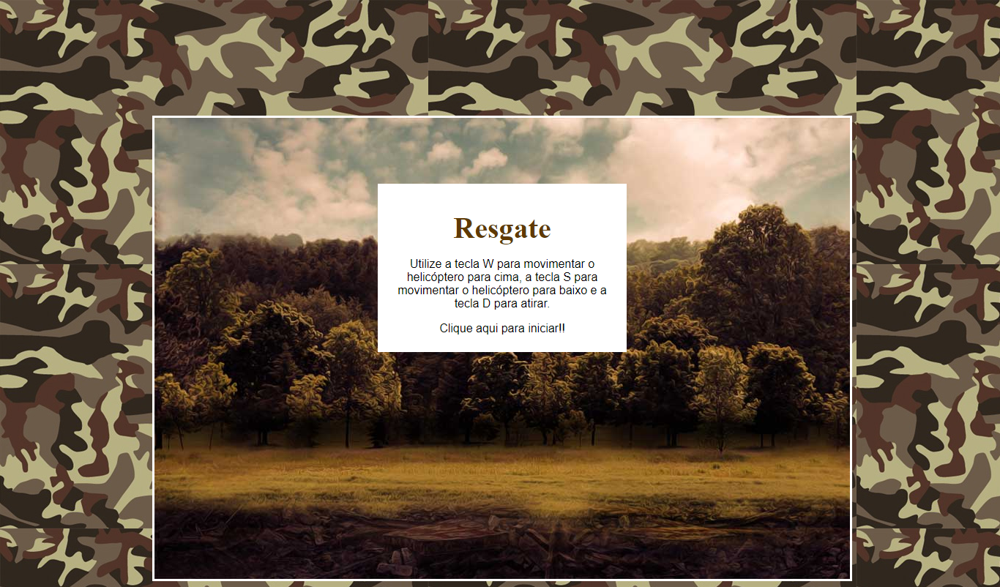

# Resgate-Game 🚁
Projeto realizado no bootcamp da Digital Innovation One, onde foi criado um game de nave
com o objetivo de resgatar prisioneiros enquanto inimigos tentam te abater.

Utilizando comandos simples:
Subir ⬆️.
Descer ⬇️.
Disparo 💥.

O projeto foi criado com o intuito de acessado via browser e forma simples.

## Ferramentas utilizadas:
HTML5
CSS3
JavaScript
jQuery

### Tela Inicial
  

### Andamento
  

### Game Over
  
