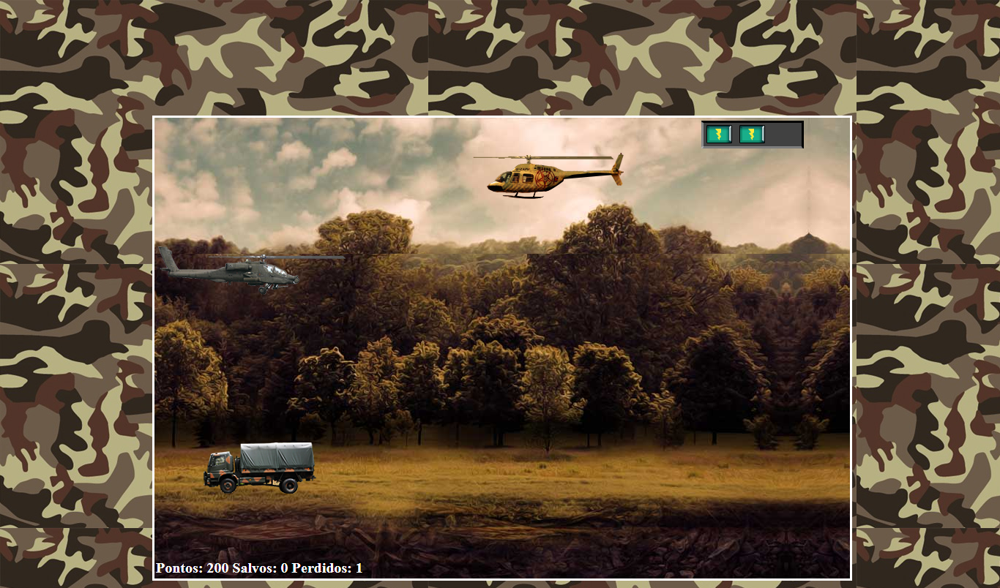
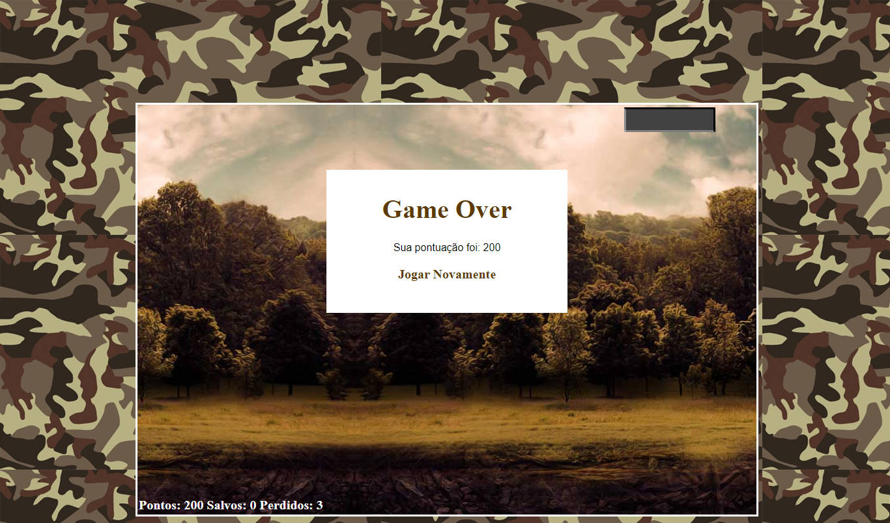

# Resgate-Game 🚁
Projeto realizado no bootcamp da Digital Innovation One, onde foi criado um game de nave
com o objetivo de resgatar prisioneiros enquanto inimigos tentam te abater.

Utilizando comandos simples:
Subir ⬆️,
Descer ⬇️,
Disparo 💥.

O projeto foi criado com o intuito de acessado via browser e forma simples.

##🛠 Tecnologias:
[HTML5]
[CSS3]
[JavaScript]
[jQuery]

### Tela Inicial
  ![Resgate inicial.png]

### Andamento
  

### Game Over
  
